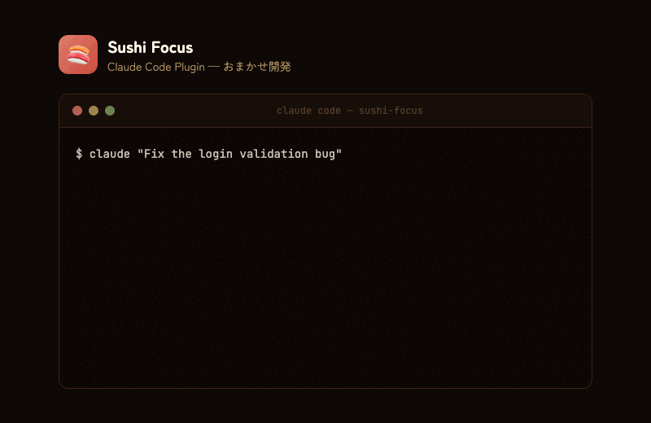

# 寿司フォーカス 🍣

[](https://github.com/Sou0327/sushi_focus/actions/workflows/ci.yml)
[](https://opensource.org/licenses/MIT)

[English](README.md)

Chrome拡張 + ローカルDaemon による「おまかせスタイル開発」。
腕利きの板前さんがあなたの集中を保ちながら、AIエージェントがコードを準備。
注文が出来上がったら自動でカウンター席へお呼びします！🍣

> **Note**: 現在は **Claude Code** のみ対応しています。Cursor等の他のAIエージェントは今後対応予定です。

<p align="center">
  
</p>

## アーキテクチャ

```
┌─────────────────┐     HTTP POST      ┌─────────────────┐    WebSocket    ┌─────────────────┐
│   Claude Code   │ ───────────────▶ │     板前さん     │ ───────────────▶ │  Chrome拡張     │
│  (エージェント)  │   /agent/start    │  localhost:41593 │  task.started   │  カウンター席    │
│                 │   /agent/log      │    (厨房)        │  task.log       │  ダッシュボード   │
│                 │   /agent/need-input│                │  task.need_input│                 │
│                 │   /agent/done     │                 │  task.done      │                 │
└─────────────────┘                   └─────────────────┘                 └─────────────────┘
```

**ご注文 → 厨房で準備 → 握れたらお呼びします 🍣**

## 前提条件

- **Node.js** 20以上
- **pnpm** 9以上（なければ `npm install -g pnpm` でインストール）
- **Google Chrome** ブラウザ

## インストール

### オプション A: GitHub Releases からダウンロード（推奨）

1. [Releases](https://github.com/Sou0327/sushi_focus/releases) ページへ
2. 最新の `sushi-focus-extension-vX.X.X.zip` をダウンロード
3. ZIP ファイルを解凍
4. Chrome で `chrome://extensions` を開く
5. 右上の「**デベロッパーモード**」をON
6. 「**パッケージ化されていない拡張機能を読み込む**」→ 解凍したフォルダを選択

### オプション B: ソースからビルド

下記の [クイックスタート](#クイックスタート) を参照。

## Claude Code プラグイン（Daemon 自動起動）

プラグインをインストールすると、Claude Code 起動時に自動で Daemon が起動します。

Claude Code 内で以下を実行:

```
/plugin marketplace add Sou0327/sushi_focus
/plugin install sushi-focus-daemon@sushi-focus
```

Claude Code を再起動。セッション開始時に以下が表示されます:

```
[sushi-focus] Checking daemon on port 41593...
[sushi-focus] Starting daemon...
[sushi-focus] Daemon started successfully (v0.1.0)
```

## クイックスタート

### Step 1: クローンと依存関係のインストール

```bash
git clone https://github.com/Sou0327/sushi_focus.git
cd sushi_focus
pnpm install
```

### Step 2: ビルド

```bash
# 板前さん（厨房サーバー）をビルド
pnpm build:daemon

# Chrome拡張（カウンター席）をビルド
pnpm build:extension
```

### Step 3: 厨房オープン

```bash
pnpm dev:daemon
```

以下のメッセージが表示されれば成功：

```text
╔═══════════════════════════════════════════════════════════╗
║              寿司フォーカス - 板前さん 🍣                   ║
║                      v0.1.0                              ║
╠═══════════════════════════════════════════════════════════╣
║  HTTP API: http://127.0.0.1:41593                          ║
║  WebSocket: ws://127.0.0.1:41593/ws                        ║
╚═══════════════════════════════════════════════════════════╝
```

> **注意**: 厨房は別ターミナルで起動したままにしておいてください。

### Step 4: Chrome拡張をインストール

1. Chromeで `chrome://extensions` を開く
2. 右上の「**デベロッパーモード**」をONにする
3. 「**パッケージ化されていない拡張機能を読み込む**」をクリック
4. `sushi_focus/extension/dist` フォルダを選択
5. 寿司フォーカス🍣 アイコンが追加されていることを確認

### Step 5: カウンター席に座る

1. Chromeのツールバーで 寿司フォーカス アイコンをクリック
2. ポップアップが表示される
3. 「**厨房を覗く**」ボタンをクリック
4. 右側にSide Panelが開く - あなたのカウンター席です！

または、Chrome右上の「サイドパネル」アイコン（📋）から 寿司フォーカス を選択。

## 使い方

### エージェントから厨房に注文

エディタ（Claude Code, Cursor等）の作業状況を厨房（Daemon）に送信すると、拡張機能に表示されます。

#### curl で直接送信

```bash
# 注文（タスク開始）
curl -X POST http://127.0.0.1:41593/agent/start \
  -H "Content-Type: application/json" \
  -d '{"taskId":"task-1","prompt":"Fix authentication bug"}'

# 厨房からの報告（ログ出力）
curl -X POST http://127.0.0.1:41593/agent/log \
  -H "Content-Type: application/json" \
  -d '{"taskId":"task-1","message":"Analyzing codebase..."}'

# 板前さんからお呼び（入力待ち）
curl -X POST http://127.0.0.1:41593/agent/need-input \
  -H "Content-Type: application/json" \
  -d '{"taskId":"task-1","question":"Which approach should I use?"}'

# へい、お待ち！（タスク完了）
curl -X POST http://127.0.0.1:41593/agent/done \
  -H "Content-Type: application/json" \
  -d '{"taskId":"task-1","summary":"Fixed 3 files"}'
```

#### スクリプトを使用

```bash
# 注文
./scripts/sushi-focus-notify.sh start --prompt "Fix authentication bug"

# 厨房からの報告
./scripts/sushi-focus-notify.sh log --message "Analyzing codebase..."

# 板前さんからお呼び
./scripts/sushi-focus-notify.sh need-input --question "Which approach?"

# へい、お待ち！
./scripts/sushi-focus-notify.sh done --summary "Fixed 3 files"
```

### Claude Code との連携

**方法 1: プラグイン（推奨）** - 上記の [Claude Code プラグイン](#claude-code-プラグインdaemon-自動起動) を参照。

**方法 2: 手動 hooks 設定** - 提供された hooks 設定をプロジェクトにコピー:

```bash
# プロジェクトルートから
cp scripts/claude-code-hooks.json .claude/settings.json
```

またはグローバル設定 `~/.claude/settings.json` にコピー。

hooks ファイルには SessionStart（タスク自動開始）、UserPromptSubmit（プロンプトログ）、PreToolUse（ツール活動ログ）、PostToolUse、Notification、Stop（タスク完了）が含まれます。

### 認証（オプション）

Daemon API を保護するには共有シークレットを設定:

```bash
export SUSHI_FOCUS_SECRET="your-secret-here"
```

hooks とスクリプトは `SUSHI_FOCUS_SECRET` が設定されている場合、自動的に `Authorization: Bearer` ヘッダーを付与します。本 README の curl 例は簡略化のためヘッダーを省略しています。認証有効時は `-H "Authorization: Bearer $SUSHI_FOCUS_SECRET"` を追加してください。

### 板前さんからお呼びです！（need_input）

- エージェントが `/agent/need-input` を送信すると、板前さんからお呼びがかかります
- 自動でIDEにフォーカスが戻る

### へい、お待ち！（done）

- 脱線サイト（YouTube等）を見ている時に `/agent/done` が来ると：
  1. 1.5秒のカウントダウンが表示される
  2. 「キャンセル」を押さなければ自動でIDEにフォーカスが戻る
- 開発サイトを見ている時は通知のみ（自動復帰なし）

## 厨房API（Daemon）

### External Agent API（IDE連携用）

外部エージェント（Claude Code, Cursor等）からイベントを送信するためのエンドポイント。

| エンドポイント | メソッド | 説明 |
| -------------- | -------- | ---- |
| `/health` | GET | ヘルスチェック（`{ok, version, gitBranch}`） |
| `/agent/start` | POST | 注文（タスク開始） |
| `/agent/log` | POST | 厨房からの報告（ログ出力） |
| `/agent/need-input` | POST | 板前さんからお呼び（自動復帰トリガー） |
| `/agent/done` | POST | へい、お待ち！（自動復帰トリガー） |
| `/agent/cancel` | POST | お返しする（タスクキャンセル） |
| `/agent/progress` | POST | 準備進捗 |

#### リクエスト形式

```typescript
// POST /agent/start
{ taskId?: string, prompt: string, repoId?: string, image?: string }

// POST /agent/log
{ taskId: string, message: string, level?: "info" | "warn" | "error" | "debug" | "success" | "focus" | "command" }

// POST /agent/need-input
{ taskId: string, question: string, choices?: { id: string, label: string }[] }

// POST /agent/done
{ taskId: string, summary?: string, filesModified?: number }

// POST /agent/cancel
{ taskId: string }

// POST /agent/progress
{ taskId: string, current: number, total: number, label?: string }
```

### Internal Task API（内部タスク管理）

厨房内部でタスクを作成・管理するためのエンドポイント。

| エンドポイント | メソッド | 説明 |
| -------------- | -------- | ---- |
| `/tasks` | POST | 注文作成（`{repoId, prompt}`） |
| `/tasks/current` | GET | 現在の注文取得 |
| `/tasks/:id/cancel` | POST | 注文キャンセル |
| `/tasks/:id/choice` | POST | 質問への回答送信（`{choiceId}`） |
| `/repos` | GET | リポジトリ一覧 |

### Focus Settings API（IDE自動フォーカス設定）

厨房側でIDEウィンドウに自動フォーカスする機能の制御。`.env` で初期値設定。

| エンドポイント | メソッド | 説明 |
| -------------- | -------- | ---- |
| `/focus/settings` | GET | 現在のフォーカス設定取得 |
| `/focus/settings` | POST | フォーカス設定更新 |
| `/focus/now` | POST | 手動で即座にIDEにフォーカス |

```bash
# .env 設定例
FOCUS_ENABLED=true         # フォーカス機能の有効/無効
FOCUS_APP=Cursor           # フォーカス対象アプリ（Code, Cursor, Terminal, iTerm）
FOCUS_ON_NEED_INPUT=true   # お呼び時に自動フォーカスするか
FOCUS_ON_DONE=true         # 完了時に自動フォーカスするか
```

### WebSocketイベント型

厨房が `ws://127.0.0.1:41593/ws` を通じてブロードキャストするイベント。

```typescript
type KitchenEvent =
  | { type: 'task.started',    taskId: string, repoId: string, startedAt: number, hasImage?: boolean }
  | { type: 'task.log',        taskId: string, level: string, message: string }
  | { type: 'task.need_input', taskId: string, question: string, choices: {id: string, label: string}[] }
  | { type: 'task.done',       taskId: string, summary: string, meta?: { changedFiles?: number, tests?: string } }
  | { type: 'task.error',      taskId: string, message: string, details?: string }
  | { type: 'task.progress',   taskId: string, current: number, total: number, label?: string }
```

## トラブルシューティング

### 「準備中」と表示される

厨房（Daemon）が起動していない可能性があります：

```bash
# 厨房オープン
pnpm dev:daemon
```

### Side Panelが開かない

1. `chrome://extensions` で拡張を再読み込み
2. Chromeを再起動

### ビルドエラーが出る

```bash
# node_modulesを削除して再インストール
rm -rf node_modules extension/node_modules daemon/node_modules
pnpm install
pnpm build
```

## 開発者向け

### 開発モード

```bash
# 厨房（ホットリロード）
pnpm dev:daemon

# 拡張の変更後は手動リロード
# chrome://extensions で 寿司フォーカス の🔄ボタンをクリック
```

### プロジェクト構造

```text
sushi_focus/
├── extension/          # Chrome拡張 (MV3) - カウンター席
│   ├── src/
│   │   ├── background/ # Service Worker (厨房マネージャー)
│   │   ├── sidepanel/  # ダッシュボード (カウンター席)
│   │   ├── popup/      # おもてなしスタイル選択
│   │   ├── options/    # 店のルール
│   │   └── shared/     # 共有型定義
│   └── dist/           # ビルド出力
├── daemon/             # ローカル常駐サーバー (板前さん/厨房)
│   └── src/
│       ├── server/     # Express + WebSocket
│       └── task/       # 注文管理
├── scripts/            # 連携スクリプト
│   ├── sushi-focus-notify.sh  # 注文通知スクリプト
│   └── claude-code-hooks.json # Claude Code hooks例
└── package.json        # ワークスペース設定
```

## コントリビュート

開発ガイドラインは [CONTRIBUTING.md](CONTRIBUTING.md) を参照してください。

## ライセンス

MIT

---

**へい、らっしゃい！** 🍣
